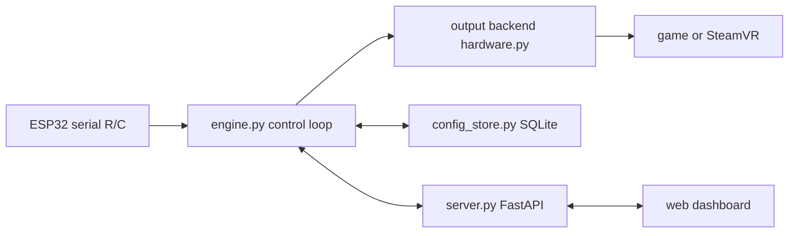

# CLAUDE.md: Maratron orientation for agents

Read this first. It's the fast map; deeper docs are linked at the bottom.

## What this is
Maratron turns a **manual treadmill** into game input. A magnet on the belt roller passes a reed switch on an **ESP32**, which counts pulses over USB serial. A **Python app** converts pulses/sec into either a **virtual Xbox controller** (vgamepad/ViGEmBus) or a **SteamVR controller** (custom OpenVR driver), and serves a **web dashboard** (FastAPI) for config + live metrics.

## Data flow

VR path: `engine → hardware.VRGamepadOutput → vr_ipc.py (shared memory) → vr_driver/ C++ driver → SteamVR`.

## File map (`python/src/maratron/`)
- `app.py`: entry/CLI (`--mock`, `--serial-port`, `--ui`, `--port`, `--auto-switch`, `--vr-role`, `--data-dir`).
- `engine.py`: control loop, session finalize, output + serial management, active-profile logic.
- `control.py`: pulses/sec → joystick math (normalize → gain → EMA → rolling window → curve).
- `models.py`: Pydantic models (`Person`, `Treadmill`, `InclinePreset`, `Profile`, `Session`, `AppConfig`, `EngineStatus`). **Source of truth for the data shape.**
- `config_store.py`: SQLite storage + one-shot migrations (guarded by `schema_v*` meta flags).
- `session.py`: session tracking, ACSM calories, steps, climb; trims idle head/tail from pace.
- `hardware.py`: serial reader + output backends (`make_output`: gamepad / VR / composite / null).
- `vr_ipc.py`: shared-memory bridge to the C++ driver (**struct MUST match `driver_maratron.cpp`**).
- `window_watcher.py`: foreground-window watcher for auto profile-switch.
- `web/index.html`: the whole dashboard (no build step; vanilla JS).

Top-level: `python/run.py` (launcher), `arduino/treadmill_to_py/` (ESP32 sketch), `vr_driver/` (OpenVR driver + `resources/` + `tools/`), `docs/`.

## Run & test
```powershell
python python\run.py --mock          # dashboard on localhost:8000, no hardware
python python\run.py --serial-port COM7
pytest python\tests                  # MUST be in the venv (.venv). base interpreter lacks pydantic/fastapi
```

## Current state
- **People & Treadmills** relational model + **sessions/metrics** (calories/steps/climb, incline) shipped.
- **Output mode is per-`Profile`** (game X = VR, game Y = gamepad). `vr_role`/`vr_invert_y` are global.
- **PCVR keep-both locomotion is SOLVED**: the treadmill drives movement while both controllers stay live (Treadmill role + the driver's own input profile whose legacy binding routes the stick to the left hand). Verified on Dungeons of Eternity and Ancient Dungeon. See `docs/vr-locomotion.md`.
- Work lives on `main` (may be unpushed to origin).

## Gotchas
- **VR driver rebuild** (`vr_driver/build.ps1`) fails with `LNK1104` if SteamVR is running; close it first.
- `vr_ipc.py`'s struct and `vr_driver/src/driver_maratron.cpp`'s `MaratronShared` must stay byte-identical.
- COM port is host-specific (pick it in the dashboard or `--serial-port`).
- VR device **role** is Treadmill by default; left/right (sacrifice a hand) are debug-only via `--vr-role`.
- No-headset VR testing: `vr_driver/tools/` (`test_vr_ipc.py`, `client_read.py`) + the null-driver "virtual headset" recipe in `docs/vr-locomotion.md`.

## Deeper docs
- `README.md`: full architecture, firmware/serial protocol, setup.
- `docs/vr-locomotion.md`: how keep-both works, why earlier attempts failed, planned improvements.
- `docs/vr-compatible-games.md`: which games work with which output.
- `vr_driver/README.md`: building/registering the SteamVR driver, per-game binding.
