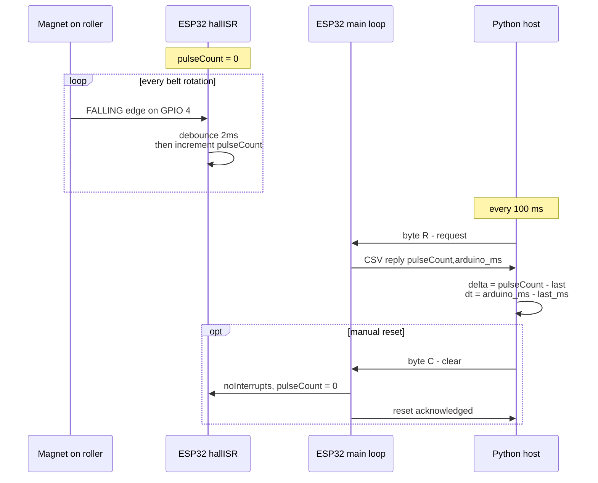
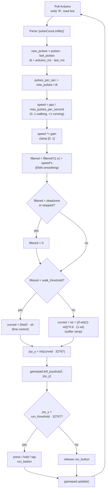

# Maratron

Turn a manual (non-motorized) treadmill into an Xbox controller, so you can walk and run inside PC games. A magnet on the belt roller passes a hall sensor wired to an ESP32; the ESP32 counts pulses and a Python script translates pulses-per-second into a virtual Xbox 360 left-stick deflection (plus optional sprint button).

Tested target: Skyrim. Should work with any game that takes a standard Xbox controller.

## Credits

This project started from these two earlier mouse-sensor-based VR treadmill projects, and inherits the same general idea (read motion of the belt, drive a virtual joystick):

- https://github.com/ZeGollyGosh/VR-Treadmill `treadmill.py` (original mouse-based approach)
- https://github.com/Mark-Renzi/VR-Treadmill

Maratron's main divergence is dropping the optical mouse pointed at the belt in favor of a hall-effect reed sensor + ESP32, which is much more robust (no drift, no need to wake up the mouse, no `mouse.position = (700, 500)` trick to recenter, no Windows mouse acceleration to fight).

## Stack

- **Sensor:** hall-effect / reed switch sensing magnets glued to the front roller of the treadmill (11 magnets, one revolution = 12.9 cm of belt travel).
- **MCU:** ESP32, Arduino framework. Single sketch in `arduino/treadmill_to_py/`.
- **Transport:** USB serial @ 115200 baud, request/response (no streaming).
- **Host:** Python 3 on Windows.
  - `pyserial`: talks to the ESP32
  - `vgamepad`: exposes a virtual Xbox 360 controller via ViGEmBus
  - `pydantic`: typed profile config

## Hardware

```mermaid
flowchart LR
    subgraph Treadmill["Treadmill (physical)"]
        Roller["Front roller<br/>11 magnets"]
        Hall["Hall / reed sensor"]
        Roller -- "magnet passes" --> Hall
    end

    subgraph ESP["ESP32 (firmware)"]
        ISR["hallISR()<br/>2ms debounce"]
        Counter["pulseCount<br/>volatile uint32_t"]
        SerialFW["Serial @ 115200<br/>R / C protocol"]
        Hall -- "FALLING edge<br/>on GPIO 4" --> ISR
        ISR --> Counter
        Counter --> SerialFW
    end

    subgraph PC["Windows host"]
        Py["python/src/treadmill.py<br/>(pyserial + pydantic)"]
        VG["vgamepad<br/>(ViGEmBus driver)"]
        Game["Game<br/>(Skyrim, ...)"]
        SerialFW <-- "USB serial" --> Py
        Py -- "left stick + sprint" --> VG
        VG -- "virtual Xbox 360 pad" --> Game
    end
```



- Hall sensor signal -> ESP32 GPIO `4` (`HALL_PIN` in the sketch). `INPUT_PULLUP` is used; the sensor pulls the line to GND on each magnet pass, which fires a `FALLING` interrupt.
- 11 magnets are mounted around the front roller. With a roller circumference of ~12.9 cm, each pulse = `12.9 / 11 ≈ 1.17 cm` of belt travel. Adjust `AMOUNT_OF_MAGNETS` and `ONE_REVOLUTION_CM` in `python/src/treadmill.py` to match your physical setup.

## How the Arduino sketch works

File: `arduino/treadmill_to_py/treadmill_to_py.ino`

- `pulseCount` is a `volatile uint32_t` incremented inside `hallISR()`.
- The ISR has a 2 ms software debounce (`interruptTime - lastInterruptTime > 2`). Cheap reeds can ring; without this you'd get phantom pulses on every magnet pass.
- The main loop does no work until the host asks for data. There is no autonomous "tick"; the ESP32 just keeps counting.
- Serial protocol:
  - Host sends `R` (single byte, "Request") -> ESP32 replies `pulseCount,millis()\n` (CSV, two unsigned ints).
  - Host sends `C` ("Clear") -> ESP32 resets `pulseCount` to 0 under `noInterrupts()` and replies `ACK:RESET`.
- The pulse count is **absolute and monotonic** (until reset). The host computes deltas; this means a dropped serial frame doesn't lose steps.



## How the Python host uses the data

File: `python/src/treadmill.py`

Per poll (~100 ms):

1. Write `R`, read one line, parse `pulse_count, arduino_millis`.
2. `new_pulses = pulse_count - last_pulse_count` and `interval_s = (arduino_millis - last_arduino_ms) / 1000`. Using the Arduino's own clock for the delta avoids any jitter from Python sleep timing.
3. `pulses_per_sec = new_pulses / interval_s`.
4. Normalize: `speed = pulses_per_sec / max_pulses_per_second` -> ~0..1 for walking, >1 when running.
5. Apply `gain`, clamp to `[0, 1]`.
6. EMA smoothing: `filtered = filtered * (1 - smoothing) + speed * smoothing`.
7. Snap to 0 when stopped, apply deadzone.
8. **Sensitivity curve**: two-segment piecewise, quadratic below `walk_threshold` for fine low-speed control, `x^0.6` above for a softer ramp into running. (This is the part we want to replace with a user-editable curve, see roadmap.)
9. Scale to Xbox stick range (`-32768..32767`) and push to `gamepad.left_joystick(x=0, y=joy_y)`.
10. **Sprint**: when `joy_y > run_threshold * 32767`, press `run_button` (`HOLD` keeps it pressed; `CLICK_RELEASE` taps it for 100 ms; `NONE` disables it). For Skyrim, full-stick deflection feels like a walk in-game, so the default profile uses `NONE` and you tap sprint manually.



On `Ctrl+C`, total pulses are converted to centimeters via `DISTANCE_PER_PULSE_CM` and appended to `distance_log.json`.

### Profile parameters (cheat sheet)

| Goal | Parameter | Direction |
|---|---|---|
| Walk MORE to reach 100% | `max_pulses_per_second` | increase |
| Walk LESS to reach 100% | `max_pulses_per_second` | decrease |
| Feels sluggish | `smoothing` | increase |
| Joystick too twitchy | `smoothing` | decrease |
| Ignore tiny accidental movements | `deadzone` | increase |
| Sprint triggers too early | `run_threshold` | increase |

The active profile is defined at the bottom of `python/src/treadmill.py` (currently `skyrim`). Edit and re-run.

## Setup

Prereqs:

- Python 3.10+ on Windows
- [ViGEmBus driver](https://github.com/nefarius/ViGEmBus/releases) installed (required by `vgamepad`)
- Arduino IDE (or PlatformIO) with ESP32 board support
- A USB cable and a known COM port (default expected: `COM7`, change `SERIAL_PORT` in `python/src/treadmill.py`)

Install Python deps:

```powershell
python -m venv .venv
.\.venv\Scripts\activate
pip install -r requirements.txt
```

Flash the ESP32:

1. Open `arduino/treadmill_to_py/treadmill_to_py.ino` in Arduino IDE.
2. Select your ESP32 board + port, upload.
3. Open Serial Monitor at 115200 once to confirm you see `ESP32 Treadmill Sensor Ready...`. Close the monitor (it holds the port) before running the Python script.

## Run

```powershell
.\.venv\Scripts\python.exe python\src\treadmill.py
```

You should see `Connected. Waiting for data...`. Step on the belt: `Total / New / Uptime / Time since last` should print each time pulses arrive. The virtual Xbox controller is now driving the left stick.

`Ctrl+C` to stop. A line is appended to `distance_log.json` with total cm/m/km for the session.

## Development

Layout:

```
arduino/treadmill_to_py/       ESP32 firmware (single .ino)
python/src/
  treadmill.py                 main entry point
  max_pps_view.py              calibration: walk to find your real max pulses/sec
  debug.py                     minimal serial probe (sanity check the link)
distance_log.json              per-session distance log (gitignored)
curve.json                     placeholder for future curve tuner output
.legacy/                       earlier mouse-sensor approach + curve editor (reference only)
```

Calibration workflow when first setting up:

1. **Pulse-per-cm**: power off, mark the belt, move it ~30 cm by hand, count pulses in `debug.py`. Plug values into `AMOUNT_OF_MAGNETS` and `ONE_REVOLUTION_CM`.
2. **Max pulses/sec**: run `max_pps_view.py`, walk at the pace that should be "100% walk" for several seconds, note the peak. Set `max_pulses_per_second` in your profile to that number.
3. **Smoothing/deadzone/threshold**: launch a game, iterate on the profile until walking feels right and the sprint trigger lines up with where you'd naturally start jogging.

When tweaking the sketch, remember to close the Arduino Serial Monitor before running the Python script, only one process can hold the COM port at a time.

## Roadmap

Most of these were sketched in the original plan and have reference implementations sitting in `.legacy/` from the earlier mouse-sensor era. Items are roughly ordered by what unblocks what.

- **Curve tuner (PyQt6)**. Replace the hardcoded two-segment piecewise curve with a draggable spline. Reference implementation: `.legacy/mouse_sensor/src/Screens/CurveEditorWindow.py` (drag/add/delete control points, draggable trigger-zone slider, save/load to JSON  `curve.json` is the expected on-disk format). Integration is the part that was half-done in the deleted `python/src/ui.py`: after computing `filtered_speed`, feed it to `curve_data.interpolate_y_from_points(int(filtered_speed * 32767))`, then convert the returned graph-Y back to a joystick value via `(margin + graph_height - y) / graph_height * 32767`. Replaces the `walk_threshold` / curve power constants.

- **Distance log viewer**. `distance_log.json` already accumulates per-session totals. A small tab showing daily/weekly km, a graph, and per-profile attribution would close the loop. Models already drafted: `UsageMetrics` in `.legacy/mouse_sensor/src/classes/profile.py`.

- **Profiles**. One curve + sprint config per game, auto-switched by foreground window name. Reference models in `.legacy/mouse_sensor/src/classes/profile.py`:
  - `HardwareConfig`  belt size, magnets/revolution (per treadmill, not per game)
  - `UserConfig`  step size, max walking speed (per user)
  - `GameProfile`  window name, run trigger threshold, curve points (per game)
  - `UserProfile`  bundles the above + metrics
  - `AppState`  top-level container with active user/profile

- **Boot wizard**. First-launch flow: pick/create user, calibrate hall sensor sensitivity, calibrate stride length by walking N known steps and entering N, create a default profile.

- **Auto profile switching**. Watch foreground window title; switch the active `GameProfile` when it matches. Original notes also suggested toggling Windows mouse acceleration on start/stop  keep that idea in mind if any games need it.

- **Sprint mode polish**. Today's "click_release" mode taps the button once on threshold crossing. Some games want repeated taps while held above threshold  make this configurable.

- **Hot-reload of profile**. Editing `python/src/treadmill.py` requires a restart; the eventual UI should swap profiles live without reconnecting the gamepad.

## Notes / gotchas

- `vgamepad` requires the ViGEmBus driver. If `VX360Gamepad()` raises, install/repair the driver first.
- The default `SERIAL_PORT = "COM7"` is host-specific  check Device Manager.
- The 2 ms ISR debounce in the sketch is tuned for ~11 magnets at walking speed. If you have many more magnets or run very fast, you may start dropping pulses; raise it cautiously.
- `distance_log.json` is appended every session and is gitignored.
- The 100 ms poll interval is a compromise: shorter = lower input lag but more serial chatter; longer = smoother averaging but laggy direction changes.
