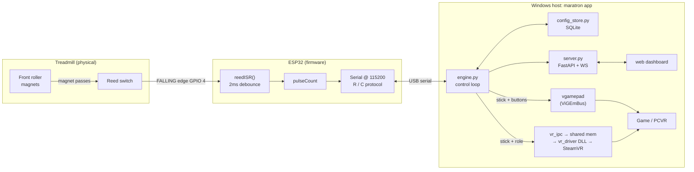

# Maratron

Turn a manual (non-motorized) treadmill into game input: walk/run inside PC games and **PCVR**. A magnet on the belt roller passes a reed switch wired to an ESP32; the ESP32 counts pulses over USB serial, and a Python app translates pulses-per-second into either a **virtual Xbox controller** stick or a **SteamVR treadmill controller**, with a terminal-launched **web dashboard** for config and live metrics.

> **Docs status (2026-07-19):** this README describes the current architecture. A dedicated *how-to-use* guide is planned. Deep dives already written: VR locomotion (`docs/vr-locomotion.md`), VR-compatible games (`docs/vr-compatible-games.md`), the SteamVR driver (`vr_driver/README.md`).

## What it does now

- **Web dashboard** (FastAPI + a single no-build HTML page), launched from the terminal and shown in a native window (pywebview) or your browser. Live **Treadmill** view (speed/distance) and **Config** (People, Treadmills, game Profiles, output).
- **People & Treadmills data model.** A **Person** (weight/height/stride) and a **Treadmill** (magnets, revolution distance, bed length, serial port, incline presets) are first-class entities. A game **Profile** belongs to a person and references a treadmill + incline preset, plus its control curve and output settings.
- **Sessions & metrics.** Auto start/stop on movement (or manual save/discard), a minimum-distance filter, per-person totals, an activity log with **incline/grade, elevation gained (climb), steps**, and **incline-aware calories** (ACSM). Session charts plot speed + cumulative climb.
- **Outputs (pluggable).** `gamepad` (virtual Xbox 360 via vgamepad/ViGEmBus), `vr` (SteamVR treadmill controller via shared memory + the `vr_driver/` DLL), `both`, or `null`.
- **PCVR locomotion: solved.** The treadmill drives smooth locomotion in SteamVR games with **both real controllers still live**. Verified on Dungeons of Eternity and Ancient Dungeon. See `docs/vr-locomotion.md`.

## Stack

- **Sensor:** a reed switch (two-wire magnetic on/off switch) sensing magnets on the front roller (default 11 magnets, one revolution ≈ 12.9 cm of belt travel, configurable per treadmill in the dashboard). A hall-effect sensor that pulls to ground also works.
- **MCU:** ESP32, Arduino framework. Single sketch in `arduino/treadmill_to_py/`.
- **Transport:** USB serial @ 115200 baud, request/response (no streaming).
- **Host:** Python 3.10+ on Windows.
  - `pyserial`: talks to the ESP32
  - `fastapi` + `uvicorn`: the dashboard server + live-metrics WebSocket
  - `pywebview`: native dashboard window (Edge WebView2)
  - `pydantic`: typed models (People/Treadmills/Profiles/Sessions)
  - `vgamepad`: virtual Xbox 360 controller via ViGEmBus (gamepad output)
  - SQLite (stdlib `sqlite3`): config/profiles/sessions storage
- **VR:** a user-mode SteamVR (OpenVR) driver in `vr_driver/` (C++). No kernel-driver signing.

## Architecture



## Hardware & firmware

- Reed switch signal → ESP32 GPIO `4` (`REED_PIN`), `INPUT_PULLUP`; the switch pulls to GND on each magnet pass, firing a `FALLING` interrupt.
- Magnets around the front roller; each pulse = `one_revolution_cm / magnets` of belt travel. Set these per treadmill in the dashboard (Config → Treadmills), not in code.

**Serial protocol** (`arduino/treadmill_to_py/treadmill_to_py.ino`):
- `pulseCount` is a `volatile uint32_t` incremented in `reedISR()` with a 2 ms software debounce.
- Host sends `R` → ESP32 replies `pulseCount,millis()\n`; host sends `C` → resets the counter and replies `ACK:RESET`.
- The count is absolute/monotonic; the host computes deltas, so a dropped frame doesn't lose steps.

## Control pipeline (host)

`python/src/maratron/control.py` turns pulses-per-second into a joystick value each tick: normalize by the treadmill's max pulses/sec → gain → clamp → EMA smoothing → rolling-window average (`speed_window_s`, smooths pace so a single hard push doesn't spike) → **user-editable point curve** (the dashboard's draggable "more speed → more forward" editor) → scaled joystick value + optional sprint/jump buttons. Incline (front/back heights → grade) feeds the metrics: ACSM calories, steps (distance / stride), and climb (distance × grade).

## Setup

Prereqs: Python 3.10+ on Windows; the [ViGEmBus driver](https://github.com/nefarius/ViGEmBus/releases) for gamepad output; Arduino IDE / PlatformIO with ESP32 support; (for VR) SteamVR + the driver built from `vr_driver/`.

```powershell
python -m venv .venv
.\.venv\Scripts\activate
pip install -r requirements.txt
```

Flash the ESP32: open `arduino/treadmill_to_py/treadmill_to_py.ino`, select your board + port, upload. Close the Arduino Serial Monitor before running Maratron (only one process can hold the COM port).

## Run

```powershell
python python\run.py                 # native dashboard window
python python\run.py --mock          # no hardware (fake speed for testing)
python python\run.py --serial-port COM7   # pick the COM port
python python\run.py --ui browser    # open in your browser instead of a window
```

The dashboard opens on `localhost:8000` (override with `--port`). Pick your COM port in Config, set up your Person/Treadmill/Profile, then step on the belt. The Treadmill view shows live speed/distance and the chosen output drives your game. Config/profiles/sessions are stored in SQLite under the data dir (`--data-dir`).

For VR, build and register the driver (`vr_driver/README.md`), set a profile's Output to `vr`, and see `docs/vr-locomotion.md` for the one-time per-game binding.

## Development

```
arduino/treadmill_to_py/       ESP32 firmware (single .ino)
python/run.py                  launcher (puts python/src on sys.path → maratron.app)
python/src/maratron/           the app package
  app.py           entry / CLI args (--mock, --serial-port, --ui, --port, --auto-switch, --data-dir)
  server.py        FastAPI REST + /ws live metrics
  engine.py        control loop, session finalize, output/serial management
  control.py       pulses/sec → joystick math (curve, smoothing, window)
  models.py        Person / Treadmill / InclinePreset / Profile / Session / AppConfig / EngineStatus
  config_store.py  SQLite storage + migrations
  session.py       session tracking, ACSM calories, steps, climb
  hardware.py      serial reader + output backends (gamepad / VR / composite / null)
  vr_ipc.py        shared-memory bridge to the C++ SteamVR driver
  window_watcher.py foreground-window watcher (auto profile switch)
  web/index.html   the dashboard (no build step)
.legacy/                       retired code: pre-dashboard scripts (treadmill.py, max_pps_view.py), old mouse-sensor projects
vr_driver/                     SteamVR (OpenVR) driver + resources + no-headset test tools
docs/                          VR locomotion, VR-compatible games
```

Tests: `pytest python/tests` (control-math parity, models, grade/calories/steps).

## Roadmap

Most of the original roadmap (curve editor, profiles, auto-switching, distance/metrics viewer) is **done** and lives in the dashboard. What's left:

- **FTMS / Octonic**: expose Maratron as an FTMS Bluetooth treadmill so on-headset apps (e.g. Octonic on Quest) read it directly. Decision: do it on the **ESP32** (BLE GATT server), not Windows. Next milestone.
- **How-to-use guide**: a dedicated usage/walkthrough doc (planned).
- **Dashboard polish**: expose the VR role selector (treadmill/left/right) now that Treadmill is the confirmed keep-both default.

## Credits

Started from earlier mouse-sensor VR-treadmill projects (same idea: read belt motion, drive a virtual joystick): [ZeGollyGosh/VR-Treadmill](https://github.com/ZeGollyGosh/VR-Treadmill), [Mark-Renzi/VR-Treadmill](https://github.com/Mark-Renzi/VR-Treadmill). Maratron's divergence is a reed switch + ESP32 (no optical-mouse drift/recenter/acceleration issues) plus the dashboard, data model, and PCVR locomotion.

## Notes / gotchas

- `vgamepad` needs the ViGEmBus driver; install/repair it if the virtual pad fails to create.
- COM port is host-specific: pick it in the dashboard (Config) or pass `--serial-port`.
- Close the Arduino Serial Monitor before running (it holds the port).
- Rebuilding the VR driver requires SteamVR closed (it locks the DLL). See `vr_driver/README.md`.
