# Hardware build

This part covers the sensor, the wiring, the magnets, and the measurements the software needs.

In this part you:

- wire the reed switch to the ESP32 (GPIO 4 and GND),
- mount the magnets and align them to the sensor,
- optionally brace the frame with paracord,
- measure the magnet count, the one-revolution distance, the bed length, and the deck heights.

## Contents

- [How the sensor works](#how-the-sensor-works)
- [Wire the ESP32](#wire-the-esp32)
- [Mount the magnets](#mount-the-magnets)
- [Position the sensor](#position-the-sensor)
- [Reinforce the frame (optional)](#reinforce-the-frame-optional)
- [Take the measurements](#take-the-measurements)

## How the sensor works

A magnet on the roller passes a reed switch once per turn per magnet. A reed switch is a simple two-wire magnetic switch. It closes when a magnet is near and opens again after the magnet passes. It gives only on or off, not a signal level, so it needs no calibration. Each time it closes, it pulls the signal line to ground, and the ESP32 counts that as one pulse. More magnets give more pulses per turn, so the speed reading updates more often.

## Wire the ESP32

The firmware uses GPIO 4 with the internal pull-up resistor. The pull-up holds the line high. When a magnet closes the reed switch, the switch pulls the line to ground, which triggers a falling-edge interrupt. A reed switch has two wires and no polarity, so you cannot wire it the wrong way round.

1. Connect one reed-switch wire to ESP32 GPIO 4.
2. Connect the other reed-switch wire to an ESP32 GND pin.
3. Connect the ESP32 to the PC with the USB cable.

The reed switch needs no power pin. The internal pull-up does the rest. On this build the treadmill's original sensor connector is reused: two jumpers take one wire to GPIO 4 and the other to GND.

<a href="images/hw-esp32-wiring.jpg">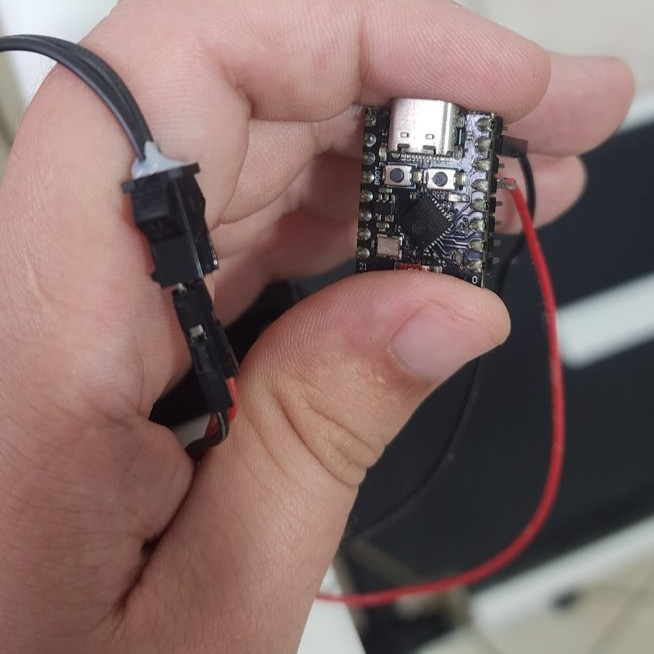</a>
> The ESP32 with the sensor wire on GPIO 4, the ground wire, and the USB cable.

<a href="images/hw-esp32-wiring2.jpg">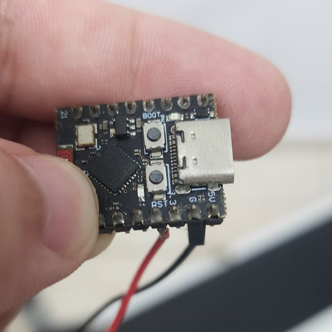</a>
> A second view of the same wiring.

## Mount the magnets

Most manual treadmills already have one magnet and a sensor that feed the treadmill's own console. One pulse per turn is coarse. More magnets give more pulses per turn, so slow, small movements read more precisely. For fast movement, even one, two, or four magnets can be enough. This build uses 11 magnets, which is about one pulse every 1.2 cm of belt travel (12.9 cm per revolution divided by 11). You enter this count in the app later as "Number of magnets".

The sensor is usually already fixed to the frame, so mount the magnets so they pass the existing sensor. One easy way to space them evenly is a disc that turns with the roller:

1. Measure around the disc. On this build the disc is 42 cm around.
2. Divide that length by the number of magnets. The disc is a closed loop, so 11 magnets make 11 equal gaps: 42 cm / 11 = about 3.8 cm. On a loop the first and last positions meet at the same point, so the number of gaps equals the number of magnets (unlike a straight line, where marks make one fewer gap).
3. Wrap a temporary tape around the disc and mark each gap.
4. Fix one magnet on each mark, with the same pole facing out.
5. Keep the treadmill's original magnet as the zero mark.

<a href="images/hw-magnet-disc.jpg">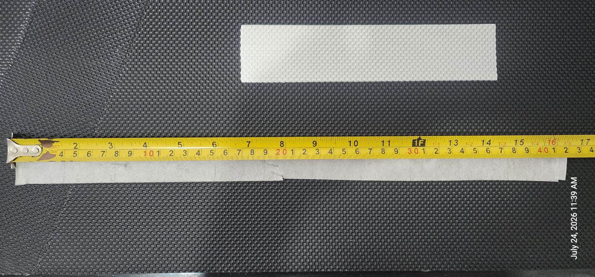</a>
> The magnet disc with a tape measure. The 42 cm around the disc splits into equal sections, one per magnet.

<a href="images/hw-magnet-disc-closeup.jpg">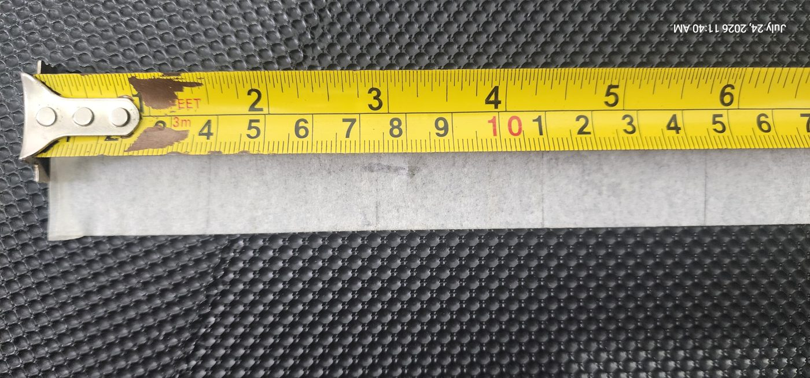</a>
> Close-up of the disc marks.

<a href="images/hw-magnets.jpg">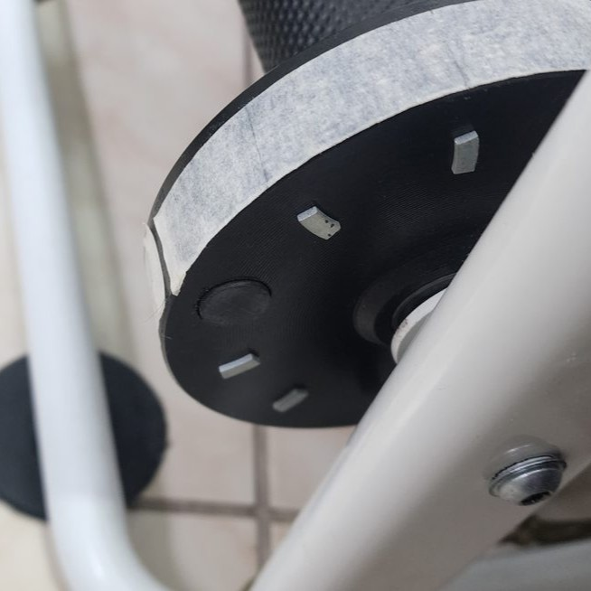</a>
> A magnet fixed on each mark.

The finished layout looks like this, with the magnets evenly spaced around the disc and the original magnet as the zero mark:

<a href="images/roller_magnets_placement.png">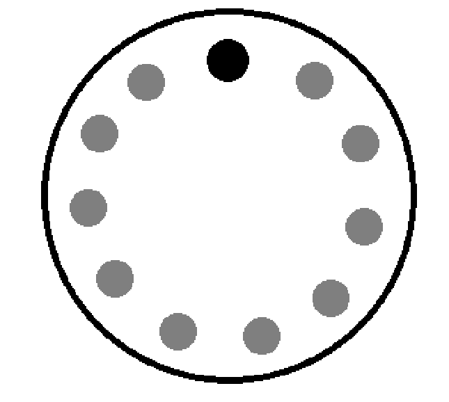</a>

## Position the sensor

On many manual treadmills the sensor is already fixed to the frame, next to the roller. If so, leave it in place; you have already aligned the magnets to it above.

If your treadmill has no sensor, fix one close to the magnet path with a small air gap. Each magnet must pass the sensor face on every turn.

1. Hold the sensor near the magnet path.
2. Set a small gap of a few millimeters.
3. Fix the sensor so it cannot move.

<a href="images/hw-sensor.jpg">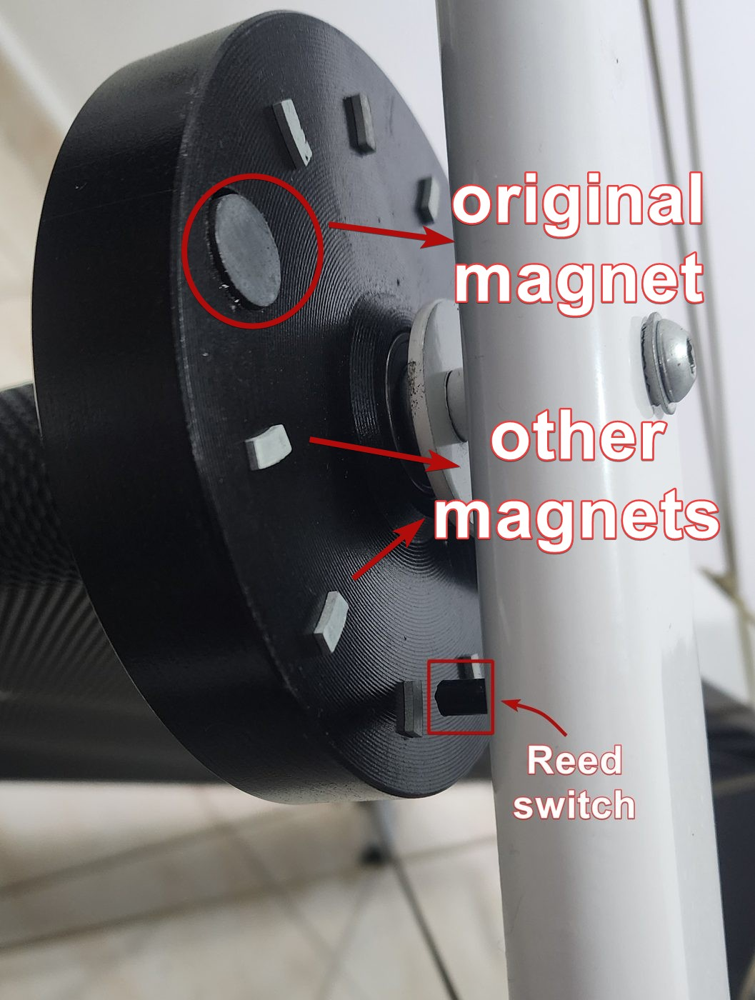</a>
> The reed switch mounted next to the disc, with the gap to the magnets visible.

## Reinforce the frame (optional)

A light folding treadmill can flex while you walk. The flex does not stop the sensor, but it makes the frame feel loose. On this build, paracord adds rigidity. Every frame is different, so adapt the pattern to yours.

1. Tie a triangle pattern on the arm supports to stop side-to-side sway.
2. Tie a cross pattern under the bottom frame to stop the deck twisting.
3. Use a trucker's hitch on each line so you can pull it tight.

<a href="images/hw-paracord-arms.jpg">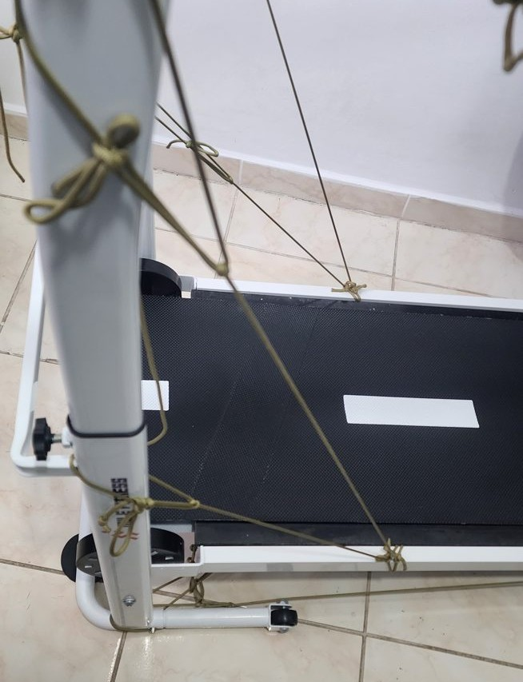</a>
> Triangle bracing on the arm supports.

<a href="images/hw-paracord-frame.jpg">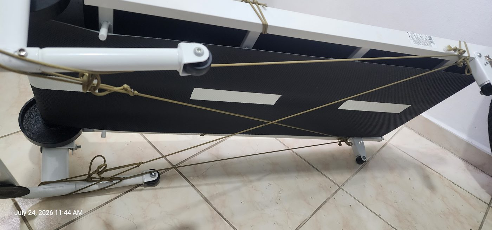</a>
> Cross bracing under the bottom frame.

## Take the measurements

The app needs these numbers. Take them now and keep them for part 3. This drawing shows the bed length (A), the front height (B), and the back height (C).

<a href="images/measures.png">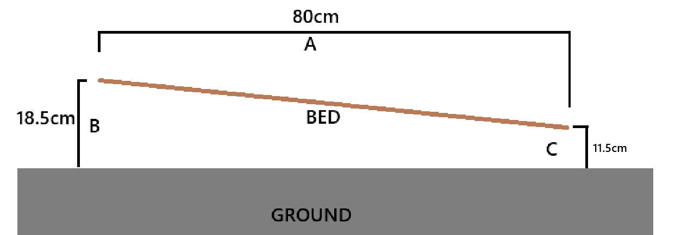</a>

### One-revolution distance

This is how far the belt moves in one full turn of the roller. One full turn passes every magnet once, so it is one pulse per magnet, 11 pulses on this build. The app divides the belt travel by the magnet count to get the distance per pulse. It is not the size of the magnet disc.

1. Mark one point on the belt and one fixed point on the frame.
2. Turn the roller by hand for one full turn, until the belt mark returns to the frame mark. That is 11 pulses on this build.
3. Measure how far the belt moved. On this build that is 12.9 cm, so each pulse is about 1.2 cm.

### Bed length

This is the board length under the belt, from the front edge to the back edge. The app uses it with the deck heights to work out the incline. On this build it is 80 cm.

<a href="images/measure-bed-length.jpg">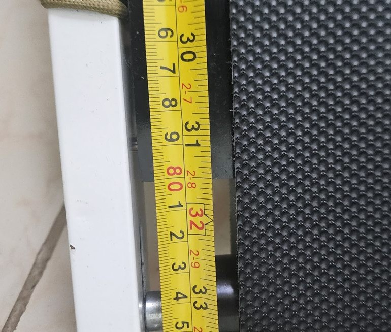</a>
> The tape measure along the board, from the front edge to the back edge.

<a href="images/measure-bed-length-start.jpg">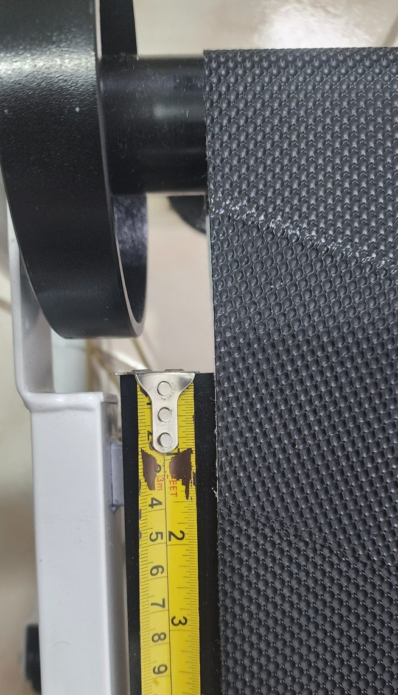</a>
> The tape hooked at the front edge of the bed, where the length measurement begins.

### Front and back deck heights

Incline comes from the height difference between the front and the back of the deck. Measure both from the floor. On this build the front is about 18.5 cm and the back about 11.5 cm.

1. Measure the height of the front edge of the deck.
2. Measure the height of the back edge at each notch you use.

<a href="images/measure-front-height.jpg">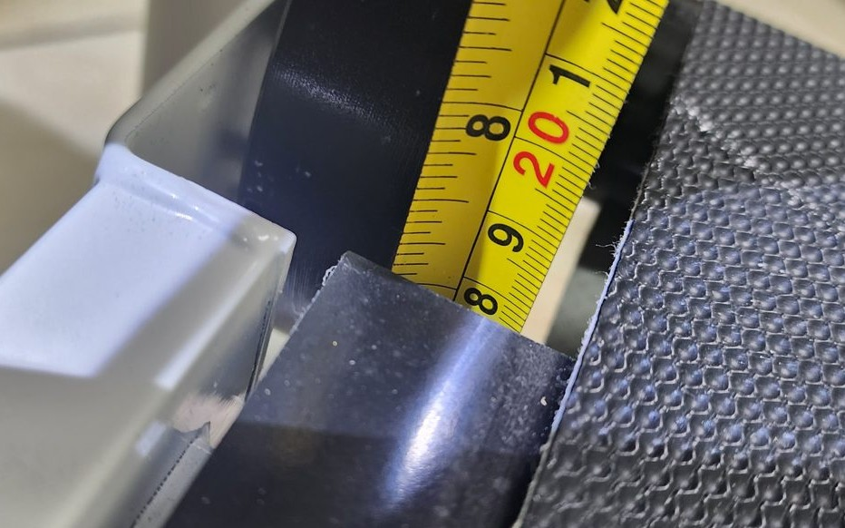</a>
> The tape at the front edge, about 18.5 cm.

<a href="images/measure-back-height.jpg">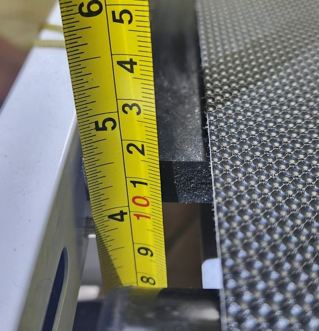</a>
> The tape at the back edge, about 11.5 cm.

On this build the front height is fixed; only the back height changes. A pin at the back sets it: pull the pin and the back leg swings up, which lowers the back of the deck, so the front-to-back drop grows and the incline increases. Each leg position is one incline preset that you enter in part 3.

<a href="images/incline-hook.jpg">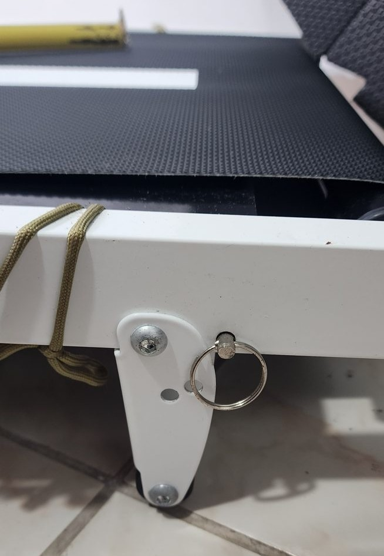</a>
> The back-height pin. Pull it to raise the leg and lower the back of the deck.

Next: [Software setup](02-software-setup.md).
