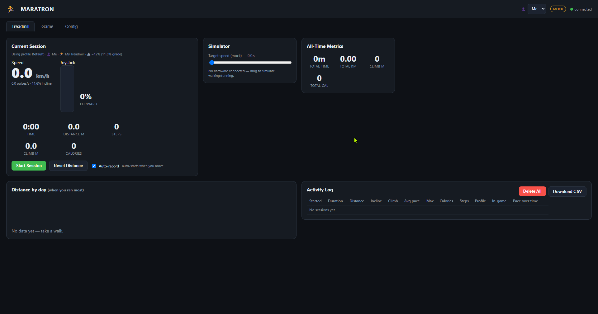
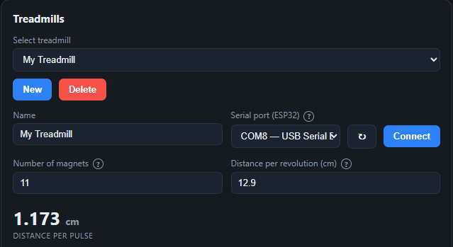

# Software setup

This part flashes the ESP32 firmware, installs the app, and runs it.

In this part you:

- flash the ESP32 firmware,
- install the app and the ViGEmBus driver,
- run the dashboard and connect the treadmill.

## Contents

- [Flash the firmware](#flash-the-firmware)
- [Install the app](#install-the-app)
- [Run the app](#run-the-app)
- [Connect the treadmill](#connect-the-treadmill)

## Flash the firmware

The firmware is one Arduino sketch. It counts pulses and answers the PC over USB serial at 115200 baud.

1. Open `arduino/treadmill_to_py/treadmill_to_py.ino` in the Arduino IDE.
2. Select your ESP32 board and its COM port.
3. Upload the sketch.
4. Open the Serial Monitor at 115200 baud once. You see the line `ESP32 Treadmill Sensor Ready...`.
5. Close the Serial Monitor.

Warning: close the Serial Monitor before you run Maratron. Only one program can hold the COM port.

The sketch debounces the sensor so it ignores pulses that arrive too close together. Raise the debounce threshold in the sketch only if you see false or phantom pulses.

### How the PC talks to the ESP32

The PC sends single characters. The ESP32 answers.

- Send `R` to request a reading. The ESP32 replies `pulseCount,uptime_ms`.
- Send `C` to reset the counter. The ESP32 replies `ACK:RESET`.

The pulse count only rises until a reset. The PC works out the difference between readings, so a lost message does not lose distance.

## Install the app

Run these commands from the repository root.

```
python -m venv .venv
.\.venv\Scripts\activate
pip install -r requirements.txt
```

The exact pinned versions live in [`requirements.txt`](../../requirements.txt), so this guide does not repeat them.

Install the [ViGEmBus driver](https://github.com/nefarius/ViGEmBus/releases) for gamepad output. vgamepad needs it. [Part 5](05-vr.md) covers the VR driver.

## Run the app

Start the dashboard from the repository root.

```
python python/run.py
```

The dashboard opens in a native window. It also serves on `http://127.0.0.1:8000`.

Run `python python/run.py --help` for the full list of flags. The one you need most at the start is `--mock`, which runs the app without hardware and gives you a slider to simulate walking.

<a href="images/ui-first-run.png"></a>
> The dashboard right after launch, on the Treadmill tab, before any setup.

## Connect the treadmill

1. Open the Config tab.
2. Open the Treadmills panel.
3. Select your ESP32 COM port in "Serial port (ESP32)".
4. Click Connect.
5. Check that the status line shows a connected state.

<a href="images/ui-config-treadmill.png"></a>
> The Treadmills panel with a COM port selected and a connected status. The distance-per-pulse value is visible.

Next: [Calibration](03-calibration.md).
