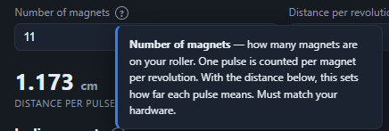
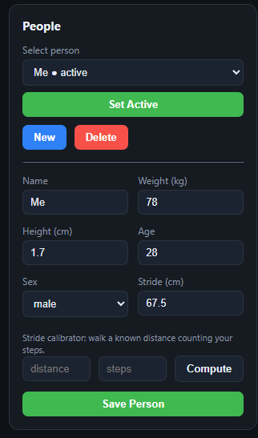
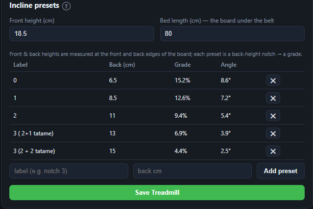
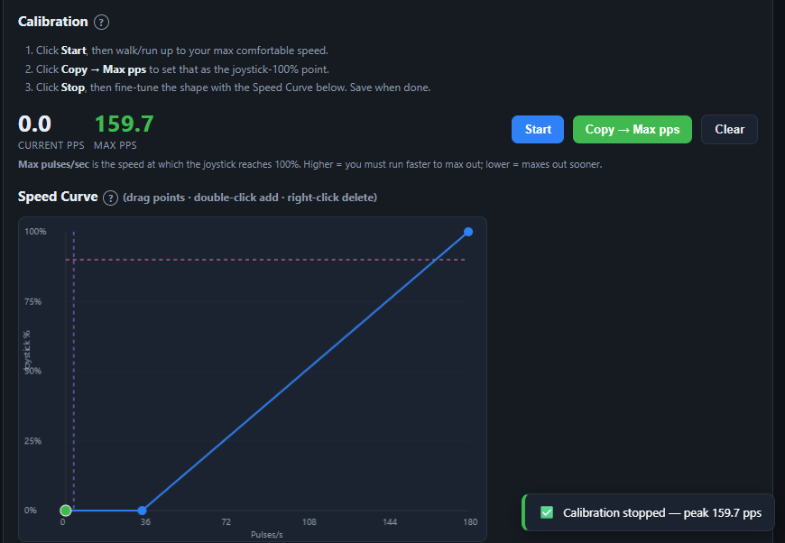
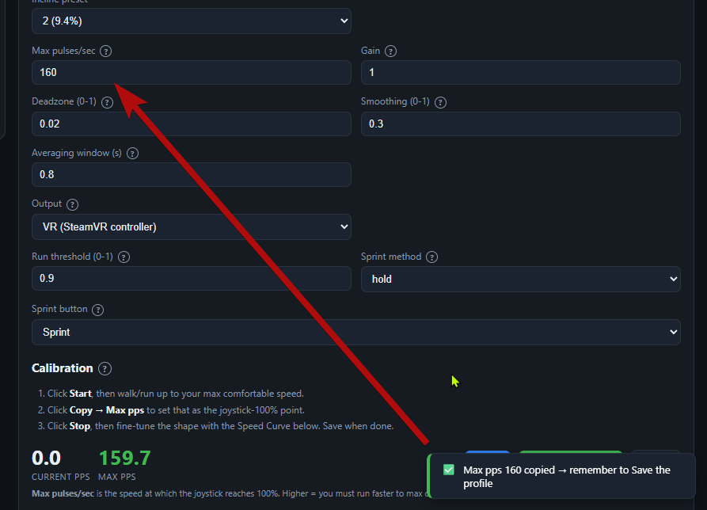
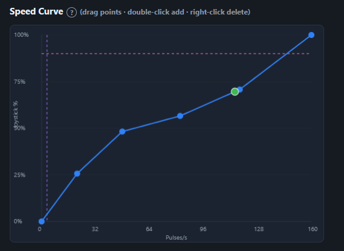

# Calibration

This part sets up your person and treadmill, then calibrates speed and incline. Do it once. Repeat only when the setup changes.

In this part you:

- set up your person: weight, height, and stride,
- set up your treadmill: magnet count, distances, and incline presets,
- calibrate speed with Max pps and shape the speed curve.

## Contents

- [Set up your person](#set-up-your-person)
- [Set up your treadmill](#set-up-your-treadmill)
- [Calibrate speed](#calibrate-speed)
- [Shape the speed curve](#shape-the-speed-curve)

Every field has a "?" help button. Click it for a short note.

> A help popover open, for example on Number of magnets or Serial port.

## Set up your person

The person holds your body metrics. The app uses them for calories and steps.

1. Open the Config tab and the People panel.
2. Click New.
3. Enter a name.
4. Enter your weight in kilograms.
5. Enter your height in centimeters.
6. Click Save Person.

Weight drives the calorie estimate. Height gives a rough stride if you skip the stride step.

### Calibrate your stride

Stride length sets your step count. The app measures the distance for you, so you do not need a tape measure. Do this once.

1. On the Treadmill tab, start a session so the distance starts from zero.
2. Walk on the treadmill, counting each step as you go, until you have taken 10 to 20 steps. Then stop.
3. Read the distance the app shows for the session.
4. On the People panel, enter that distance and your step count in the stride calibrator, then click Compute. The app fills the stride field.
5. Click Save Person.

> The People panel with a person filled in and the stride calibrator showing a computed stride.

## Set up your treadmill

The treadmill holds the geometry the app needs to read speed and incline.

The magnet count and the revolution distance come from part 1: see [Mount the magnets](01-hardware-build.md#mount-the-magnets) and [One-revolution distance](01-hardware-build.md#one-revolution-distance). They work together, because distance per pulse is the revolution distance divided by the magnet count.

1. Open the Treadmills panel. Click New, or select your treadmill.
2. Enter a name.
3. Enter the magnet count in "Number of magnets".
4. Enter your one-revolution value in "Distance per revolution (cm)".
5. Check the "distance per pulse" readout. It equals the revolution distance divided by the magnet count.
6. Enter the front deck height in "Front height (cm)".
7. Enter the bed length in "Bed length (cm)".
8. Click Save Treadmill.

### Add incline presets

An incline preset is a saved back-height setting, one of the pin positions from part 1. Each position tilts the deck by a different amount. You give it a label and its back height, and the app works out the grade and angle from the front height, the back height, and the bed length.

1. Enter a label for a notch, for example "notch 3".
2. Enter the back height for that notch in centimeters.
3. Click Add preset.
4. Repeat for each notch you use.
5. Check the Grade and Angle columns.
6. Click Save Treadmill.

> The incline preset table with a few notches and their computed grade and angle.

## Calibrate speed

Speed calibration sets the pace that counts as full forward on the joystick. You walk or run on the treadmill, and the app records your fastest pace as Max pps. That pace then maps to 100 percent stick. A lower Max pps means you reach 100 percent with less effort; a higher Max pps means you must go faster to max out. You do it in a game profile on the Game tab. [Part 4](04-profiles-and-use.md) covers profiles.

1. Open the Game tab. Select or create a profile.
2. Find the Calibration area.
3. Click Start.
4. Walk or run up to your top comfortable pace. Hold it for a few seconds.
5. Watch the "Current pps" and "Max pps" values.
6. Click "Copy to Max pps" to set that pace as the 100 percent point.
7. Click Stop.

> The peak pps detected after a run, shown in a toast.

> The value copied into the profile as Max pps.

## Shape the speed curve

The speed curve maps your pace to joystick output. A gentle curve gives fine control at a slow walk.

1. Open the Speed Curve area.
2. Drag a point to change the shape.
3. Double-click to add a point. Right-click to delete one.
4. Watch the live green dot as you walk. Set the shape so a steady walk feels steady in the game.
5. Click Save.

The pink line marks the sprint trigger. The purple line marks the deadzone.

> The Speed Curve with custom points, the live dot, and the pink and purple guide lines.

Next: [Profiles and daily use](04-profiles-and-use.md).
