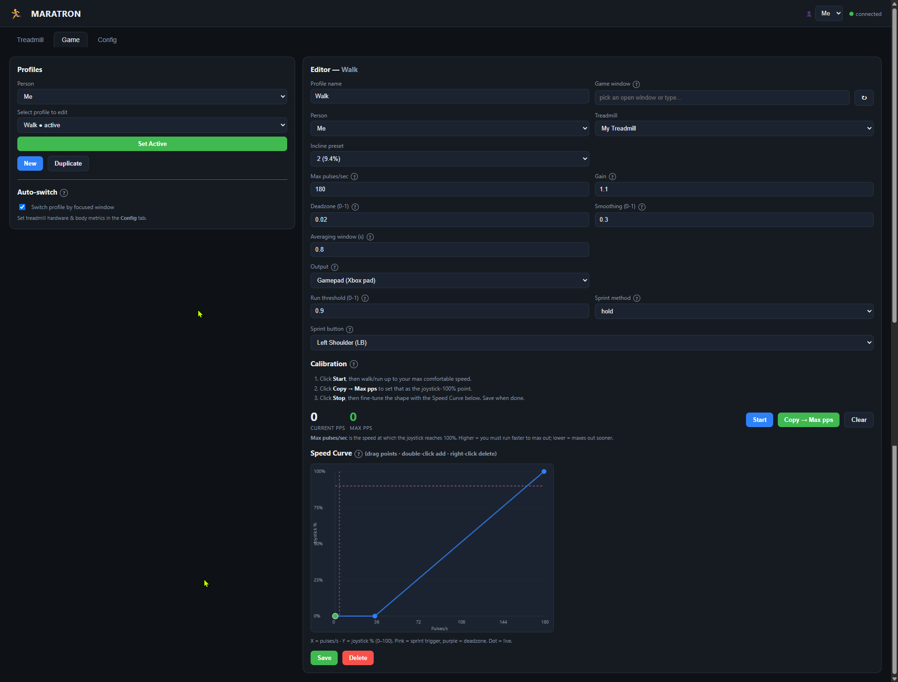
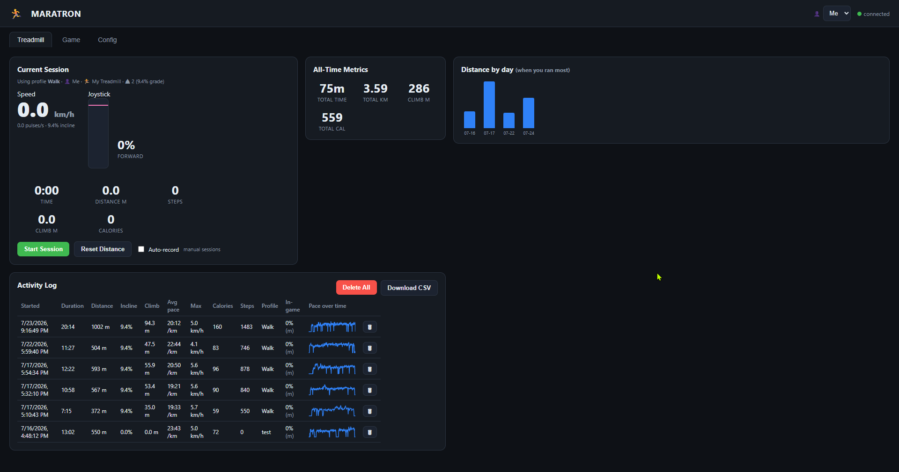
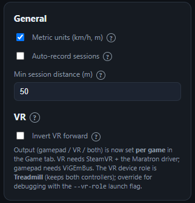
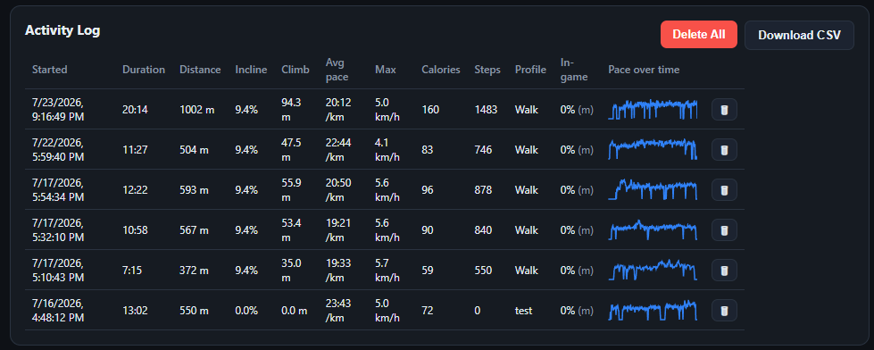
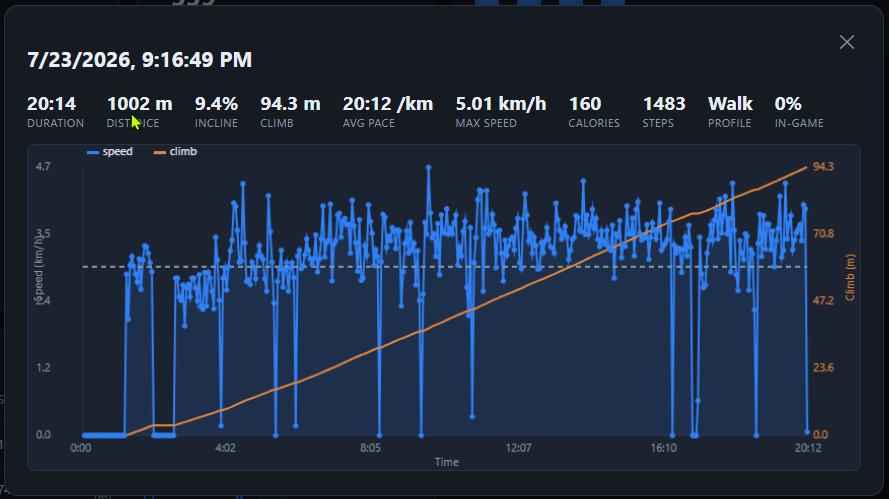
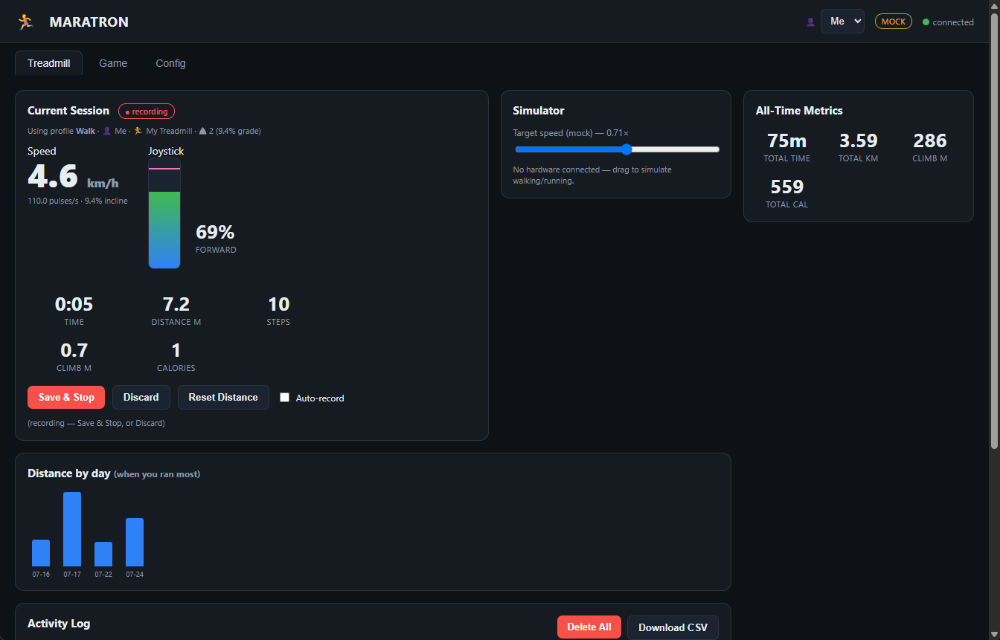

# Profiles and daily use

This part explains profiles and how to use Maratron day to day.

In this part you:

- build a per-game profile: control fields, output mode, and sprint button,
- turn on auto-switch by focused window,
- record sessions and read your metrics.

## Contents

- [What a profile is](#what-a-profile-is)
- [Create a profile](#create-a-profile)
- [Control fields](#control-fields)
- [Output mode](#output-mode)
- [Sprint button](#sprint-button)
- [Auto-switch by window](#auto-switch-by-window)
- [Set a profile active](#set-a-profile-active)
- [Record a session](#record-a-session)
- [Read your metrics](#read-your-metrics)
- [No hardware yet? Use mock mode](#no-hardware-yet-use-mock-mode)

## What a profile is

A profile is the setup for one game. It ties together:

- the person who plays,
- the treadmill you use,
- the incline preset on that treadmill,
- the game window to match for auto-switch,
- the control settings and the speed curve.

Keep one profile per game. Each person has their own profiles.

## Create a profile

1. Open the Game tab.
2. Click New.
3. Enter a profile name.
4. Select the person, the treadmill, and the incline preset.
5. Set the game window. See auto-switch below.
6. Set the control fields. See below.
7. Click Save.

> The profile editor with the person, treadmill, and incline preset selected, and the Output dropdown open.

## Control fields

- Max pulses per second: the pace that reads as 100 percent. A lower value reaches full speed sooner.
- Gain: a direct multiplier on the speed before the curve.
- Deadzone: speeds below this value read as zero.
- Smoothing: how fast the reading reacts. Higher is snappier. Lower is smoother.
- Averaging window: averages the pace over about one stride. It evens out the push and glide of a step.
- Run threshold: the joystick level that fires the sprint button.

You calibrate Max pulses per second and shape the speed curve by walking on the belt. See [Calibration](03-calibration.md).

## Output mode

Set where the profile sends movement. This is per game.

- Gamepad: a virtual Xbox controller. Use it for flatscreen games and gamepad-locomotion VR games. It needs ViGEmBus.
- VR: a SteamVR controller thumbstick. Use it for VR smooth locomotion. See [VR](05-vr.md).
- Both: drives gamepad and VR at the same time.

You can switch a profile between gamepad and VR at any time. The switch is live. It does not restart SteamVR.

## Sprint button

The sprint button fires when your pace crosses the run threshold.

- Sprint method: "hold" keeps the button pressed; "click_release" taps it; "none" disables it.
- Sprint button: which button to press. The list changes with the output mode. Gamepad shows the full set of buttons. VR shows only its two real inputs: Grip click and Thumbstick click.

## Auto-switch by window

Maratron can switch the active profile for you when you focus a game window. It is off by default.

About once a second the app reads the title of the focused window through the Windows API (no AutoHotkey or other tools). When auto-switch is on, it activates the profile whose game window text appears in that title.

1. Set the profile's game window to part of the game's title.
2. On the Game tab, turn on "Switch profile by focused window". That is the only step; no launch flag is needed.

## Set a profile active

Selecting a profile in the dropdown only opens it for editing. It does not activate it. You have to click Set Active.

1. Select the profile in the profile dropdown.
2. Click Set Active.

The Treadmill tab shows which profile, person, treadmill, and incline the session uses.

> The Treadmill tab at rest, showing the "Using profile" line and the Start Session button.

## Record a session

Maratron records sessions so you can track distance, time, calories, steps, and climb.

- Auto-record: the app starts a session when you move and stops it after you stop. Set the idle timeout and the minimum distance in the Config tab.
- Manual: click Start Session, then "Save and Stop" to keep it or "Discard" to drop it.

The app trims idle time from the start and the end of a session, so the average pace reflects the time you moved. This helps because it takes a few seconds to fasten the straps that hold you to the treadmill before you start walking, and that pause should not count against your pace.

> The General panel with metric units, auto-record, minimum session distance, and invert VR forward.

The mock-mode view below shows the same live readouts without hardware.

## Read your metrics

- All-Time Metrics: total time, distance, climb, and calories.
- Distance by day: a bar chart of daily distance.
- Activity Log: one row per session, with a pace sparkline. Click a sparkline to open the detail chart.
- Download CSV: export the sessions.

> The Activity Log with a few sessions, next to the All-Time Metrics and the Distance-by-day chart.

> The session detail chart, with speed on the left axis and cumulative climb on the right axis.

## No hardware yet? Use mock mode

Start the app with `--mock` to try it without the ESP32. A slider sets a fake speed.

> The Treadmill tab in mock mode, with the Simulator slider and the MOCK badge.

Next: [VR](05-vr.md).
