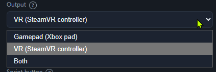
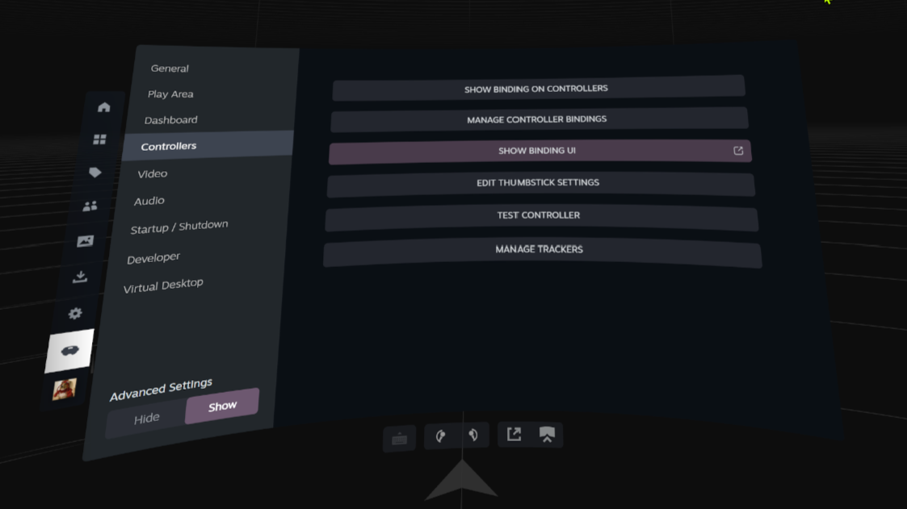
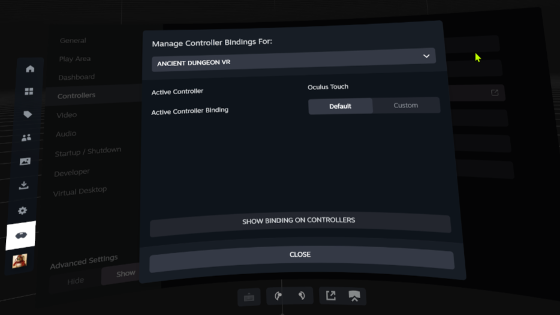
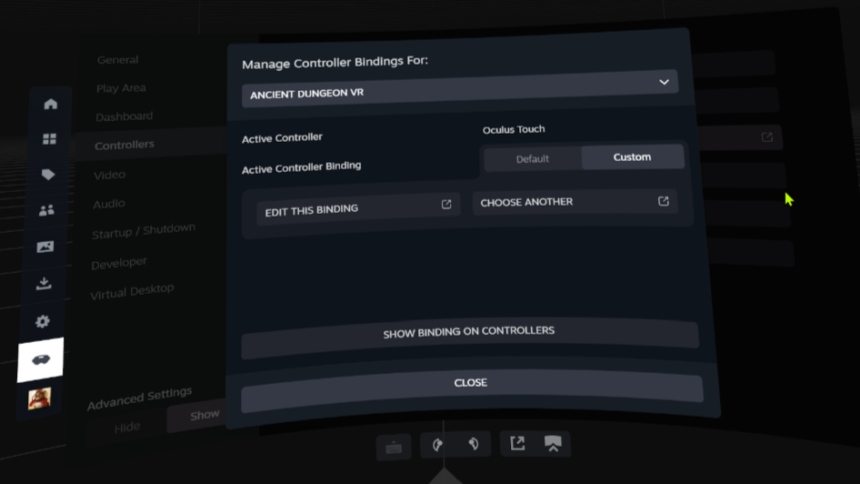
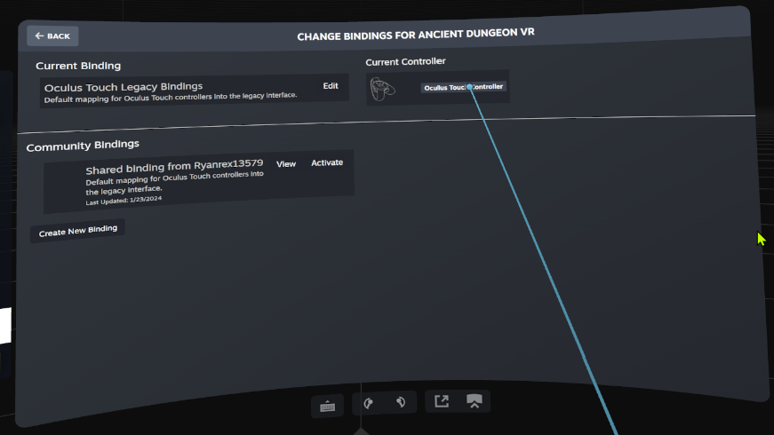
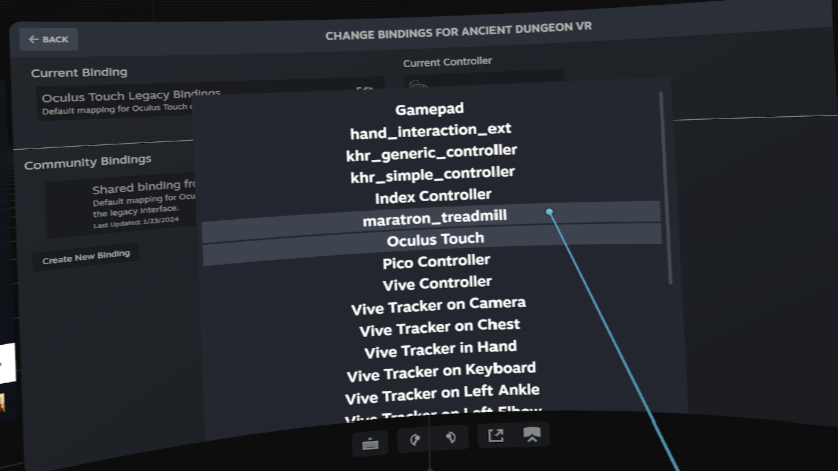
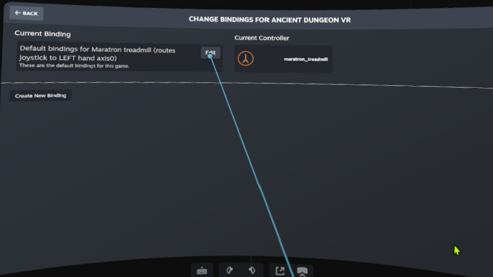
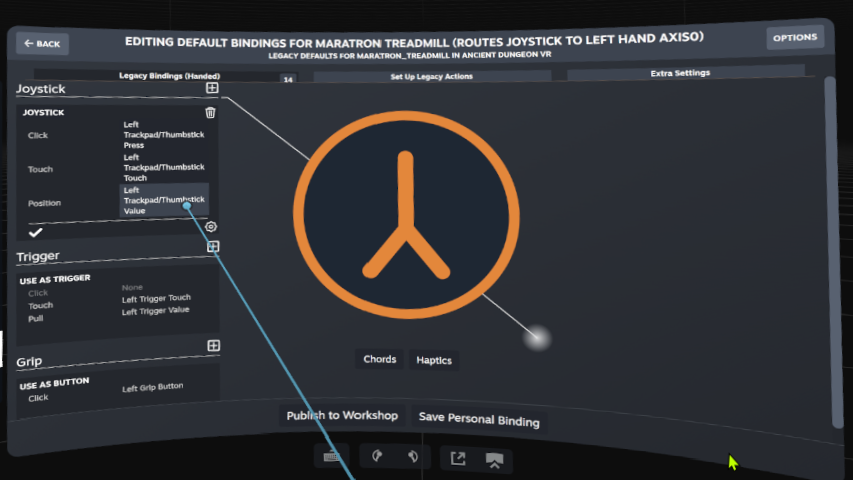
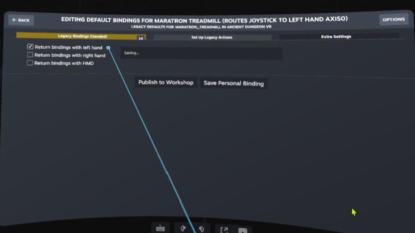

# VR

This part drives SteamVR games with the treadmill and keeps both controllers.

In this part you:

- set a profile's output to VR,
- bind the treadmill's stick to movement in each game,
- fix the forward direction if it is reversed.

## Contents

- [What works](#what-works)
- [Set up VR output](#set-up-vr-output)
- [Bind the treadmill in a game](#bind-the-treadmill-in-a-game)
- [If forward walks you backward](#if-forward-walks-you-backward)
- [Deep dives](#deep-dives)

## What works

Maratron sends the treadmill pace to SteamVR as a thumbstick. The game reads it as smooth locomotion. Both real controllers keep working. This works on PCVR, including a Quest over Link, Air Link, or Virtual Desktop, because the game runs on the PC. It does not work for native Quest games, because there is no PC game to feed.

## Set up VR output

1. Build and register the driver. See [../../vr_driver/README.md](../../vr_driver/README.md).
2. Open the game profile on the Game tab.
3. Set Output to VR.
4. Start SteamVR.

> The profile's Output dropdown, open with VR selected.

## Bind the treadmill in a game

Do this once per game. The treadmill shows in SteamVR as its own controller, `maratron_treadmill`. The screenshots below are from Ancient Dungeon VR; your game looks similar.

**1. Open the controller bindings.** In SteamVR, open Settings, then Controllers, then click "Manage Controller Bindings" (or "Show Binding UI").

**2. Pick your game, then choose the Custom binding.** Select the game, then set the binding source to Custom.

**3. Custom is now selected.**

**4. Change the current controller.** Click the Current Controller, which starts as Oculus Touch.

**5. Pick `maratron_treadmill`.** In the controller list, select maratron_treadmill.

**6. Edit the current binding.**

**7. Set the joystick position. This is the important one.** Under Joystick, set Position to Left Trackpad/Thumbstick.

**8. Return bindings with the left hand.** Open Extra Settings, turn on "Return bindings with left hand", then save.

Walk on the treadmill. The game moves you, and both real controllers still aim and grab.

### See it working

<video src="images/vr-locomotion-demo.mp4" controls width="560">
  Your viewer cannot play this inline. <a href="images/vr-locomotion-demo.mp4">Download the demo clip</a>.
</video>

> The mock speed slider driving forward locomotion in Dungeons of Eternity. This is simulated input, not live walking, but the treadmill feeds the game the same way.

## If forward walks you backward

Open the Config tab and turn on "Invert VR forward".

## Deep dives

- How keep-both works, and why earlier attempts failed: [../vr-locomotion.md](../vr-locomotion.md)
- Which games work with which output: [../vr-compatible-games.md](../vr-compatible-games.md)
