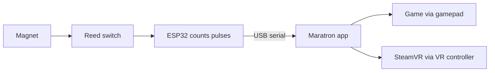

# Maratron build and use guide

Maratron turns a manual treadmill into game input. A magnet on the belt roller passes a sensor on an ESP32. The ESP32 counts pulses. A Python app on the PC turns pulses per second into a game controller, and shows a web dashboard for setup and live metrics.

This guide shows how to build the rig and how to use it. Work through the parts in order.

## This build at a glance

The values below are for the reference build. Yours may differ; the guide shows where to change each one.

- Sensor: a reed switch on ESP32 GPIO 4 (two wires, pull to ground).
- Magnets: 11 on the roller disc, one pulse each.
- One revolution: 12.9 cm of belt travel, about 1.2 cm per pulse.
- Bed length: 80 cm.
- Deck height: about 18.5 cm at the front and 11.5 cm at the back (the back adjusts for incline).
- Output: a virtual Xbox gamepad, a SteamVR controller, or both, chosen per game profile.

## Data flow

## What you build

- A sensor on the treadmill roller that makes one pulse per magnet.
- An ESP32 that counts pulses and answers the PC over USB.
- The Maratron app on a Windows PC that reads the pulses and drives a game.

## Parts list

The list below is what this build used. Substitute equivalents freely; only a magnet sensor, the magnets, and an interrupt-capable board are essential.

- A microcontroller with an interrupt-capable input. This build uses an **ESP32-C3 Super Mini**. Any ESP32 works, and any other MCU with an interrupt pin works with small changes to the firmware. Bluetooth is not needed today; it only matters for the planned FTMS feature.
- A reed switch: a two-wire magnetic on/off switch that pulls the signal line to ground when a magnet passes. This build reuses the treadmill's **original built-in reed switch**, so there is no separate part to buy. A hall-effect sensor that pulls to ground also works.
- Magnets for the roller disc. This build uses **11 small neodymium magnets**. Any small neodymium magnet works, as long as it reliably closes the reed switch; the count and even spacing matter more than the exact size.
- A couple of jumper wires to connect the reed switch to the ESP32: one to GPIO 4, one to GND.
- A USB cable from the ESP32 to the PC.

## Before you start

You need:

- A Windows PC.
- Python 3.10 or newer.
- The Arduino IDE (or PlatformIO) with ESP32 board support, to flash the sensor firmware.
- The ViGEmBus driver, for gamepad output. Part 2 covers it.
- SteamVR and the Maratron driver, for VR output. Part 5 covers it.

## Guide contents

1. [Hardware build](01-hardware-build.md) — mount the sensor and magnets, wire the ESP32, take the measurements.
   - [How the sensor works](01-hardware-build.md#how-the-sensor-works)
   - [Wire the ESP32](01-hardware-build.md#wire-the-esp32)
   - [Mount the magnets](01-hardware-build.md#mount-the-magnets)
   - [Position the sensor](01-hardware-build.md#position-the-sensor)
   - [Reinforce the frame (optional)](01-hardware-build.md#reinforce-the-frame-optional)
   - [Take the measurements](01-hardware-build.md#take-the-measurements)
2. [Software setup](02-software-setup.md) — flash the firmware, install the app, run it.
   - [Flash the firmware](02-software-setup.md#flash-the-firmware)
   - [Install the app](02-software-setup.md#install-the-app)
   - [Run the app](02-software-setup.md#run-the-app)
   - [Connect the treadmill](02-software-setup.md#connect-the-treadmill)
3. [Calibration](03-calibration.md) — set up your person and treadmill, calibrate speed and incline.
   - [Set up your person](03-calibration.md#set-up-your-person)
   - [Set up your treadmill](03-calibration.md#set-up-your-treadmill)
   - [Calibrate speed](03-calibration.md#calibrate-speed)
   - [Shape the speed curve](03-calibration.md#shape-the-speed-curve)
4. [Profiles and daily use](04-profiles-and-use.md) — make per-game profiles, record sessions, read metrics.
   - [What a profile is](04-profiles-and-use.md#what-a-profile-is)
   - [Create a profile](04-profiles-and-use.md#create-a-profile)
   - [Control fields](04-profiles-and-use.md#control-fields)
   - [Output mode](04-profiles-and-use.md#output-mode)
   - [Sprint button](04-profiles-and-use.md#sprint-button)
   - [Auto-switch by window](04-profiles-and-use.md#auto-switch-by-window)
   - [Set a profile active](04-profiles-and-use.md#set-a-profile-active)
   - [Record a session](04-profiles-and-use.md#record-a-session)
   - [Read your metrics](04-profiles-and-use.md#read-your-metrics)
   - [No hardware yet? Use mock mode](04-profiles-and-use.md#no-hardware-yet-use-mock-mode)
5. [VR](05-vr.md) — drive SteamVR games and keep both controllers.
   - [What works](05-vr.md#what-works)
   - [Set up VR output](05-vr.md#set-up-vr-output)
   - [Bind the treadmill in a game](05-vr.md#bind-the-treadmill-in-a-game)
   - [If forward walks you backward](05-vr.md#if-forward-walks-you-backward)
   - [Deep dives](05-vr.md#deep-dives)

The image shot list is in [images/README.md](images/README.md).

## Related docs

- Project overview and architecture: [../../README.md](../../README.md)
- Agent orientation: [../../CLAUDE.md](../../CLAUDE.md)
- VR locomotion deep dive: [../vr-locomotion.md](../vr-locomotion.md)
