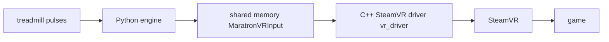

# VR locomotion: treadmill-driven movement in PCVR games (SOLVED)

**Status: WORKING.** The treadmill drives smooth locomotion in SteamVR games while **both real controllers stay fully live** (aim, grab, buttons, and even the real thumbstick). Verified in-headset on **Dungeons of Eternity** and **Ancient Dungeon** (Quest 3 over Virtual Desktop), 2026-07-19.

This is the "keep both controllers" goal. The treadmill emulates a thumbstick through a dedicated device, not by hijacking a hand.

---

## How it works (the mechanism)

The driver registers **one virtual device with our own controller type `maratron_treadmill`** and:

1. Sits on the **`/user/treadmill`** input path (**Treadmill role**, `ETrackedControllerRole = 4`). Per Valve's OpenVR SDK this role "can be used at the same time as LeftHand and RightHand" ([Driver API doc](https://github.com/ValveSoftware/openvr/blob/master/docs/Driver_API_Documentation.md)), so it never claims a hand, and both real controllers keep working.
2. Ships its **own input profile** (`resources/input/maratron_treadmill_profile.json`, `input_bindingui_mode: single_device`) plus a **legacy-binding file** (`legacy_bindings_maratron_treadmill.json`) that maps **`/user/treadmill/input/joystick` → `/actions/legacy/in/left_axis0_value`**. That routes the treadmill's joystick into the **left hand's stick axis**. That routing is the linchpin; it's what lets a non-hand device feed hand-based locomotion.
3. The game reads that left-hand stick as normal smooth-locomotion input. SteamVR merges the treadmill stick and the real left stick by **greatest absolute value**, so pushing the treadmill moves you while the idle real stick (≈0) stays out of the way. You can still walk manually too.

This design is modeled directly on **OpenVR-WalkInPlace**'s `ovrwip_controller` (<https://github.com/pottedmeat7/OpenVR-WalkInPlace>), which is the existence proof that the approach works across many titles.

---

## One-time setup per game (what the player does)

1. Activate the driver (it's registered under `vr_driver/maratron`) and run Maratron so it feeds the stick. Boot SteamVR; the device shows up as its own controller **`maratron_treadmill`** (wand icon).
2. Launch the game with **smooth/free locomotion ON** (teleport off).
3. If you don't already move: **SteamVR → Settings → Controllers → Manage Controller Bindings → [game]**, find the **`maratron_treadmill`** device, bind its **joystick → the game's move action**, and/or use **Extra Settings → "Return bindings with left hand."** Save.

That's it. From then on, walking on the treadmill moves you, both controllers free.

---

## Modes (set via the dashboard / shared-memory `role`)

| Role (shared-mem) | Behavior | Use when |
|---|---|---|
| **treadmill (4)** | Keep both controllers; needs the one-time binding above. **This is the default.** | Normal play |
| **left / right (1/2)** | Device *claims* that hand: zero binding, always moves in free-locomotion games, but the real controller on that side goes dead/frozen. | Quick test, or one-handed games |
| optout (3) | Non-hand, no auto-route. Not used. | n/a |

---

## Build / dev details

- Driver source: `vr_driver/src/driver_maratron.cpp`. Controller type, profile path, `/input/joystick` component set, and role (from shared memory) are all set in `Activate`/`RunFrame`.
- Resources (must ship alongside the DLL): `vr_driver/maratron/resources/`
  - `input/maratron_treadmill_profile.json`: the `single_device` input profile.
  - `input/legacy_bindings_maratron_treadmill.json`: routes joystick → `left_axis0`.
  - `driver.vrresources`, `icons/maratron_wand.svg`.
  - The `{maratron}` token in those paths resolves to this `resources/` dir (driver name = `maratron`).
- Rebuild: `vr_driver/build.ps1` (needs VS 2022 C++ toolset). **Stop SteamVR first**: it locks the DLL.
- Shared-memory bridge: `python/src/maratron/vr_ipc.py` (writer) ↔ the driver's `SharedMem` (reader). Struct is 48 bytes, `role` field selects the mode.

## No-headset test tooling (`vr_driver/tools/`)

- `test_vr_ipc.py writer|sweep|reader [role]`: drive/inspect the shared region without a headset.
- `client_read.py`: read a device back from SteamVR via the `openvr` pip package.
- Headless "virtual headset" for booting SteamVR with no HMD: in `steamvr.vrsettings` set `steamvr.forcedDriver="null"`, `steamvr.requireHmd=false`, `driver_null.enable=true` (revert after). Lets you verify driver load / role / `shmMapped=1` in `vrserver.txt` without hardware.

---

## Why earlier attempts failed (so we don't repeat them)

- **Gamepad output** → VR games ignore an Xbox pad for locomotion.
- **Emulating `oculus_touch`** (the type the real Quest controllers use) → our device had no separate identity in the binding UI; it was folded into the real controllers' tab, so there was nothing to bind or route.
- **Emulating a built-in `knuckles` profile** → gave a separate tab, but the built-in hand profile has **no legacy_binding** routing `/user/treadmill` to a hand, so the stick had nowhere to go. The device showed a live joystick in SteamVR's Test Controller UI but the game never moved.
- **The fix** was shipping our *own* profile + legacy binding (above). The stick, role, path, and device were all fine the whole time; only the treadmill→hand routing was missing.

## SDK facts (quoted from Valve's OpenVR SDK)

The enum is in [`headers/openvr.h`](https://github.com/ValveSoftware/openvr/blob/master/headers/openvr.h). The role behavior is in [`docs/Driver_API_Documentation.md`](https://github.com/ValveSoftware/openvr/blob/master/docs/Driver_API_Documentation.md).

- `ETrackedControllerRole`: `TrackedControllerRole_Treadmill = 4  // Tracked device is a treadmill or other locomotion device`.
- "`TrackedControllerRole_Treadmill` **can** be used at the same time as `TrackedControllerRole_LeftHand` and `TrackedControllerRole_RightHand`."
- "If both an _input_ from `TrackedControllerRole_Treadmill` and an _input_ from a handed controller are assigned to the same _action_ in an application, SteamVR **will** use the input with the greatest absolute value."

## Planned improvements (backlog)
- **Per-game output config.** The right output (`vr` treadmill / `vr` left-role / `gamepad`) depends on the game, so move the output selector from the General tab onto the **Profile** (per game), not global `AppConfig`.
- **Role default = Treadmill, reframed as advanced.** Keep-both requires role **Treadmill** (the legacy_binding paths are `/user/treadmill/...`), so make Treadmill the default and present Left/Right as a labelled **fallback** ("replaces that hand, zero binding"), not the primary knob. The role is *not* obsolete: the new approach pins it to Treadmill rather than removing it.
- **Configurable VR action buttons.** Any VR button should be mappable; default the **run/sprint** trigger to the **thumbstick click** (the usual convention) instead of the current hardcoded grip.
- **Keep gamepad output.** Retain the `gamepad` path for compatibility (gamepad-locomotion games, UEVR, flat-to-VR). It is not replaced by the VR driver.

## Refs
- OpenVR-WalkInPlace (the blueprint): <https://github.com/pottedmeat7/OpenVR-WalkInPlace>
- OpenVR treadmill/binding limitation (#1153): <https://github.com/ValveSoftware/openvr/issues/1153>
- Input-emulator override (fallback, zero-binding but fragile across SteamVR updates): <https://github.com/Erimelowo/OpenVR-InputEmulator-Fixed>
